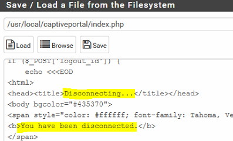

## PROJET : ARCHITECTURE RESEAU ET SECURITE ##


Année 2020 / 2021

Ce dossier technique a pour but de montrer comment mettre en place un
routeur pour administrer son réseau en y ajoutant diverses
fonctionnalités tel qu'un serveur DHCP, un portail captif etc\...

Nous avons choisi **pfSense** car c'est un routeur/pare-feu open source
avec une documentation très complète. Il a pour but d'assurer la
sécurité périmétrique. Il comporte l'équivalent libre des outils et
services utilisés habituellement sur des routeurs professionnels.

INSTALLATION ET CONFIGURATION DE PFSENSE

Avant de commencer à configurer pfSense, nous allons voir comment
l'installer. Pour se faire on se rend sur
<https://www.pfsense.org/download/> et on télécharge la version
souhaitée.

Une fois l'image téléchargé on se rend dans VMWare et on définit les
paramètres suivant lors de la création de la machine virtuelle :

-   «** Create a New Virtual Machine** »

    -   « **Custom (Advanced)** »

    -   Hardware Compatibility: « **Workstation 11.x ou Workstation
        12.x** »

    -   Install From: « **I will install the operating system later** »

    -   Select a Guest Operating System: « **Other à FreeBSD 64-bit** »

    -   Virtual Machine Name : « **pfSense** »

    -   Processors :

        -   Numbers of Processors : « **1** »

        -   Number of Cores per Processor: « **1** »

    -   Memory for this Virtual Machine: « **512 MB** »

    -   Network Connection: « **Use Bridged Networking** »

    -   SCSI Controller : « **LSI Logic (Recommended)** »

    -   Virtual Disk Type : « **IDE ou SCSI** »

        -   **Create a New Virtual Disk**

        -   Max Disk Size: « **5 GB** » « **Store Virtual Disk as a
            single file** »

Votre VM s'affiche sur l'interface VMware, cliquez sur « **Edit virtual
machine setting **», sélectionnez la ligne « **Sound Card **» et cliquez
sur le bouton « **Remove **» en bas. Sélectionnez la ligne « **USB
Controller** » et décochez toutes les cases. Sélectionnez la ligne
« **CD/DVD** » puis cochez la case « **Use ISO image File** », cliquez
sur « **Browse... **» et sélectionnez l'ISO de pfSense que vous avez
sans doute téléchargé. On peut maintenant installer pfSense. Au
redémarrage, on y applique les paramètres suivants :

« **Boot Multi User** » accepter les conditions

-   Choisir le clavier « **French ISO-8859-1** »

-   Montez d'un cran pour continuer avec le clavier **«iso.kbd
    keymap »**

-   Partitioning: «** Auto (UFS)  Guided Disk Setup** »

-   Manual Configuration « **No** »

Au démarrage, on à une suite de questions, voici les paramètres à
appliquer :


Etant donné que nous possédons qu'une seule carte réseau, nous allons en
ajouter une autre. Pour se faire, on édite les paramètres de la machine
virtuelle pfSense. En bas, cliquez sur le bouton « **Add** »
sélectionnez « **Network Adapter** » et valider.

Relancer pfSense pour prendre en compte les nouvelles cartes réseaux
qu'on vient de rajouter. Nous allons maintenant les configurer sous
pfSense.

-   Tapez « **1** » pour *Assign Interfaces* et y appliquer les
    paramètres suivants

```{=html}
<!-- -->
```
-   Should VLANs be set up now → **n**

-   Enter the WAN interface name or 'a' for auto-detection: **em0**

-   (em1 or nothing if finished): **em1**

Sur votre PC *(machine hôte),* lancez une invite de commande (CMD) et
tapez «** ipconfig /all** ». Il faut donc identifier l'**adresse IP de
votre PC** et **la passerelle.**

Vous ne pouvez pas utiliser l'adresse de votre PC pour l'interface **WAN
de pfSense** car justement votre PC l'utilise déjà. Il faut donc choisir
une autre adresse.

J'ai donc choisi **192.168.1.26 **; le masque et la passerelle ne change
pas.

> Nous allons désormais définir les adresses du WAN et du LAN :

-   Tapez « **2 **» pour « **Set interface(s) IP address **»

    -   Enter the new WAN IPv4 address: **192.168.1.26**

    -   Enter the new WAN IPv4 subnet: **24**

    -   Configure IPv6 address WAN interface via DHCP6 : **n**

    -   Do you want to revert to HTTP as the webConfigurator protocol:
        **y**

L'interface **WAN** est prête, vous pouvez même faire un test avec la
commande PING.

-   Tapez « **7** » pour «** Ping host** »

-   Tapez : **google.fr**

-   Où : **8.8.8.8**

Pour l'interface LAN, c'est la même procédure :

-   Tapez « **2 **» pour « **Set interface(s) IP address **»

    -   Enter the new LAN IPv4 address: **192.168.1.1**

    -   Enter the new LAN IPv4 subnet: **24**

    -   Do you want to enable DHCP server on LAN: **n**

    -   Do you want to revert to HTTP as the webConfigurator protocol:
        **y**

C'est bon pour le réseau **LAN (LAN-Serveurs)**. L'interface web de
pfSense est accessible à l'adresse **http://192.16.1.1/** avec les
identifiants par défaut suivant de pfSense :  **admin -- pfsense **

On obtient un résultat similaire à ça :


C'est terminé pour l'installation et la configuration à partir de la VM,
désormais tout se fera à partir de l'interface Web de pfSense. Je vais
en profiter pour installer **Windows Education N** et le configurer sur
le réseau **LAN**, je pourrais ensuite me connecter à l'interface web de
pfSense.\
Pour se faire, on accède au paramètre de notre VM Client :


Notre VM Client fait désormais partie du même réseau que notre routeur.

On se connecte à l'interface pfSense à l'adresse suivante *(dans mon
cas)* : <http://192.168.1.1>

Par défaut : user : **admin ;** password : **pfsense**

Une fois connecté, cliquez sur *\<Next>* pour procéder à une
configuration initiale. C'est facultatif, vous pouvez aussi cliquer sur
le logo pfSense pour atteindre le tableau de bord.

-   À l'étape 3/9, « **Time Server Information** », sélectionnez
    Europe/Paris dans « **Timezone** » laissez le reste par défaut.

-   À **l'étape 6/9**, mettez un mot de passe pour le **compte admin**.

-   Vous pouvez mettre pfSense en Français depuis le menu **System /
    General Setup** .

> 

MISE EN PLACE DU SERVICE DHCP

Dans votre interface pfSense, cliquez sur le menu **Services**, puis sur
**DHCP Server**. Vous aurez deux possibilités :

-   Mise en place d'un DHCP sur la partie WAN

-   Mise en place d'un DHCP sur la partie LAN

```{=html}
<!-- -->
```
-   Le plus intéressant, c'est de mettre en place un **DHCP dans la
    partie LAN** ; cliquez donc sur « LAN », juste en dessous du bandeau
    gris.

    -   On se rend dans « **Services → DHCP Server → LAN** »

    -   Pour commencer, nous cochons évidemment la case \"Enable DHCP
        server on LAN interface\".

    -   On définit la tranche d'IP attribuable sur notre réseau. Dans
        notre cas, nous autorisons des connexions de 192.168.1.10 à 50


On peut vérifier le fonctionnement du serveur DHCP en se rendant dans
« **Status → DHCP Leases** »


On aperçoit bien que ma machine soit connectée en utilisant la première
adresse de la range que nous avons attribué, c'est-à-dire
**192.168.1.10**

MISE EN PLACE DU SERVEUR DNS

-   La configuration du serveur DNS se fait via le menu « **Services /
    DNS Resolver** »

    -   On commence par activer le service (on coche la case *Enable*).

> 

-   On active la vérification des domaines, il suffit de cocher *DNSSE*.

> 

-   Ne reste qu'à s'assurer que le serveur effectue ses requêtes plutôt
    que les transmettre à d'autres serveurs. Pour ça, on décoche DNS
    Query Forwarding.

> 

Pour connaître l'état du serveur, vous pouvez passer par le menu
« **Status / DNS Resolver** ». Cet écran vous liste les serveurs
*racines* qu'il connaît. La liste est longue mais montre que,
globalement, tout marche correctement.


MISE EN PLACE D'UN PORTAIL CAPTIF

-   On commence par la configuration du portail captif :

    -   On se rend dans « **Services → Captive Portal** »

    -   On ajoute un portail captif en apppuyant sur le « **+** » 


-   Activer « **Enable Captive Portal** » et sélectionner l'interface
    « **LAN** »

-   Maximum concurrent connections : **1** (Limite le nombre de
    connexions simultanées d'un même utilisateur)

> 

-   Activer « **Enable logout popup window** » (une fenêtre popup permet
    aux clients de se déconnecter)

-   Définir « **Pre-authentication Redirect URL** » (URL de redirection
    par défaut. Les visiteurs ne seront redirigés vers cette URL après
    authentification que si le portail captif ne sait pas où les
    rediriger)

-   [**Note**]{.ul} : Avec « **http://.....** » devant le domaine :
    Exemple : <http://www.google.fr>

-   Définir « **After authentication Redirection URL** » (URL de
    redirection forcée. Les clients seront redirigés vers cette URL au
    lieu de celle à laquelle ils ont initialement tenté d'accéder après
    s'être authentifiés)

-   [**Note**]{.ul} : Avec « **http://.....** »devant le domaine :
    Exemple : <http://www.google.fr>

-   Activer « **Disable Concurrent user logins** » (seule la connexion
    la plus récente par nom d'utilisateur sera active)

-   Activer « **Disable MAC filtering** » (nécessaire lorsque l'adresse
    MAC du client ne peut pas être déterminée)

> 

-   Sélectionner «**Use an Authentication backen** »

-   Sélectionner «**Local Database**» pour «**Authentication Server**»

-   **Attention** : Ne pas sélectionner «**Local Database** » pour
    «**Secondary Authentication Server**»

-   Activer « **Local Authentication Privileges** » (Autoriser
    uniquement les utilisateurs avec les droits de « Connexion au
    portail captif ») puis **Save**

On obtient ce résultat :


**→** Création d'un groupe et utilisateur qui aura pour fonction de
créer des Utilisateurs autorisés a se connecter au Portail Captif. Ce
groupe et utilisateurs associés auront seulement le droit de créer des
Utilisateurs du Portail Captif.

-   Dans « **Groups** », cliquez sur « **Add** »

-   Renseignez le **Nom du Groupe** "Agent" et sa **description**
    "Delegation Creation Utilisateurs Portail". Cliquez "**Save**"

-   

-   Dans le menu « **Actions** », **modifier le groupe** créé en
    cliquant sur le stylo

-   

    -   Cliquez sur « **Add »** puis « **Assign Privileges** »

    -   Sélectionnez dans la liste « **WebCfg -- System: User
        Manager** » (Accès à la page de gestion des utilisateurs "User
        Manager") 

    -   Sélectionnez dans la liste « **WebCfg -- Status: Captive
        Portal** » (Voir le Status des utilisateurs connectés")

    -   **Vérifier les droits**, puis cliquez sur « **Save** »

-   Dans « **Users** », cliquez sur « **Add** »

    -   Entrer un **Nom d'Utilisateu**r "agent", son **mot de passe** et
        sa **description** (Agent autorisé à créer des utilisateurs du
        Portail Captif).

    -   Sélectionner dans « **Group membership** » le groupe « Agent »
        précédemment créé. Cliquez sur « **Move to Member of list** »
        puis « **Save** »

La délégation pour l'utilisateur "Agent" est autorisé a créer des
utilisateurs pour connexion au Portail Captif


**Configuration du Groupe et Utilisateurs autorisés à se connecter au
Portail Captif**

Ce groupe et utilisateurs associés auront seulement le droit d'utiliser
le Portail Captif.

Onglet « **Groups** », cliquez sur « **+ Add** »


Renseigner le **Nom du Groupe** « Portail » et sa **description**
« Utilisateurs du Portail ». Cliquez « **Save** »

Dans le menu « Actions », **modifier** le groupe créé en cliquant sur le
stylo

Cliquez sur « **+ Add** » rubrique « **Assigned Privileges** ».

Sélectionnez dans la liste « **User -- Services: Captive Portal
login** » (Autorisé seulement à se connecter au Portail Captif) puis
sauvegardez

Onglet « **Users** », cliquez sur « **+ Add** »

Entrer un **Nom d'Utilisateur** « testportail », son **mot de passe** et
sa **description** : « Un Utilisateur du Portail ».

Sélectionner dans « **Group membership** » le groupe « Portail »
précédemment créé. Cliquez sur « **Move to Member of list** » puis
« **Save** »


L'utilisateur testportail est désormais autorisé à se connecter au
portail captif

→**Connexion avec le Compte "agent"**

Cet utilisateur a seulement le droit de créer des Utilisateurs du
Portail Captif par délégation et de voir le Statut des utilisateurs
connectés.


Pour personnaliser le portail captif, on se rend dans « **Services** »,
« **Captive Portal** » puis on modifie la configuration du portail.

Rubrique « **Captive Portal Login Page** » : Activer « **Enable Custom
Logo Image** » puis parcourir pour sélectionner votre image


Lors de la prochaine connexion, les utilisateurs auront le droit à cette
interface de connexion :


-   Pour que le portail s'affiche en français :

    -   Sélectionner « **Diagnostics** » puis « **Edit File** »

    -   Tapez : /usr/local/captiveportal puis « Browse » puis cliquez
        sur « index.php »


Rechercher (Ctrl + F) « You are connected » → Remplacer par : « Vous
êtes connecté »


Rechercher (Ctrl + F) « Disconnecting... » et « You have been
disconnected » -- Remplacer par « Déconnexion... » et « Vous êtes
déconnecté »



Rechercher (Ctrl + F) « Invalid credentials specified » -- Remplacer par
« Les informations saisies sont invalides »


Tapez : /etc/inc puis « Browse » puis cliquez sur « captiveportal.inc »

Rechercher (Ctrl + F) « Captive Portal login Page » -- Remplacer par :
« Portail Ynov Project »


Rechercher (Ctrl + F) "User" et "Password" -- Remplacer par
"Utilisateur" et "Mot de Passe"


On a terminé pour le portail captif. En résumé, nous avons mis un
système d'administration et nous avons modifié l'interface de connexion
des utilisateurs.

CONFIGURATION DE SQUIDGUARD ET MISE EN PLACE D'UNE BLACKLIST

Sélectionner "Services" et "SquidGuard Proxy Filter"


Activer SquidGuard "**Enable**"

Activer "**Enable Log**" et "**Enable log rotation**"


Activer "**Enable Blacklist**" et inserer dans **Blacklist URL** :
http://dsi.ut-capitole.fr/blacklists/download/blacklists_for_pfsense.tar.gz

Puis cliquez sur "**Save**"

Onglet "**Blacklist**" : Cliquer sur "**Download**" pour télécharger les
listes de filtrage

Onglet "**Common ACL**", Cliquez, dans "**Target Rules List**" sur le "
**+** "

Sélectionner les catégories à bloquer (ou à autoriser)

Sélectionnez" Allow" pour "**Default access \[all\]**"

Cochez "**Do not allow IP addresses in URL**" et "**Use Safe Search
engine**"

Puis cliquer "**Save**"

MISE EN PLACE DE SNORT

Snort est un système de détection d\'intrusion libre publié sous licence
GNU GPL

Accédez au menu Pfsense System et sélectionnez l'option De gestionnaire
de paquets.


Sur l'écran du gestionnaire de paquets, accédez à l'onglet Paquets
disponibles.

Sur l'onglet Paquets disponibles, recherchez SNORT et installez le
paquet Snort.


Dans notre exemple, nous avons installé la version 3.2.9.10 du paquet
Snort.

Attendez la fin de l'installation Snort.

Accédez au menu Pfsense Services et sélectionnez l'option Snort.

Sur l'onglet Paramètres Global, localisez les règles d'abonné Snort et
effectuez la configuration suivante :

Activer Snort VRT - Oui\
Code Snort Oinkmaster - Entrez-vous OikCode

Si vous n'avez pas d'Oinkcode, accédez au [site Web
Snort,](https://www.snort.org/users/sign_up)créez un compte et obtenez
un Oinkcode gratuit.


Localiser la zone Paramètres de mise à jour des règles et effectuer la
configuration suivante :

\- Intervalle de mise à jour - Sélectionnez l'intervalle de mise à jour
souhaité\
- Heure de démarrage de mise à jour - Définir l'heure désirée pour
mettre à jour les règles Snort


Localiser la zone Paramètres généraux et effectuer la configuration
suivante :

Supprimer l'intervalle des hôtes bloqués - 1 heure\
Supprimer les hôtes bloqués après la désinstallation - Non\
- Conserver les paramètres snort après la désinstallation - Oui\
- Intervalle de mise à jour de démarrage/shutdown -- non


Sur l'onglet Interfaces Snort, cliquez sur le bouton Ajouter et
effectuez la configuration suivante.

Activer - Oui\
Interface - Sélectionnez l'interface désirée pour surveiller


Après avoir terminé la configuration, cliquez sur le bouton Enregistrer.

Sur l'écran des interfaces Snort, modifiez la configuration de
l'interface.


Accédez à l'onglet Catégories Wan et effectuez la configuration suivante
:

Résoudre les débits - Oui\
- Utiliser la politique IPS - Oui\
Sélection des politiques IPS -- Connectivité


On peut observer les dangers repérés par Snort dans Service → Snort →
Alert


